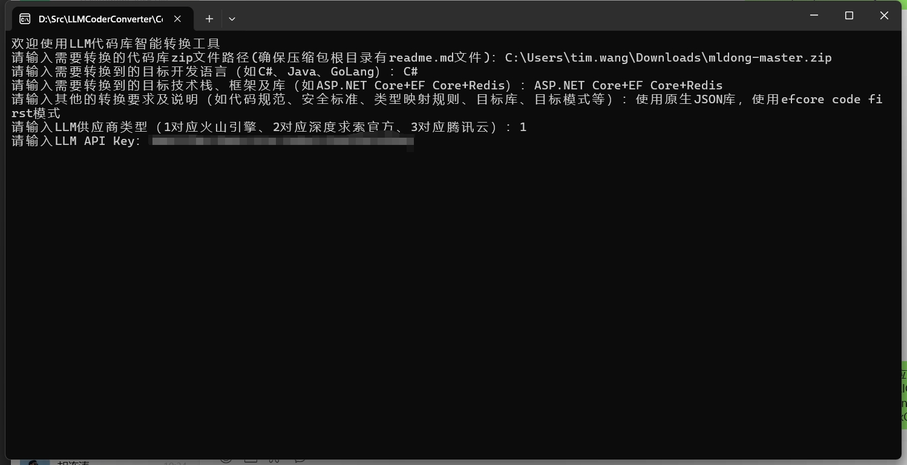
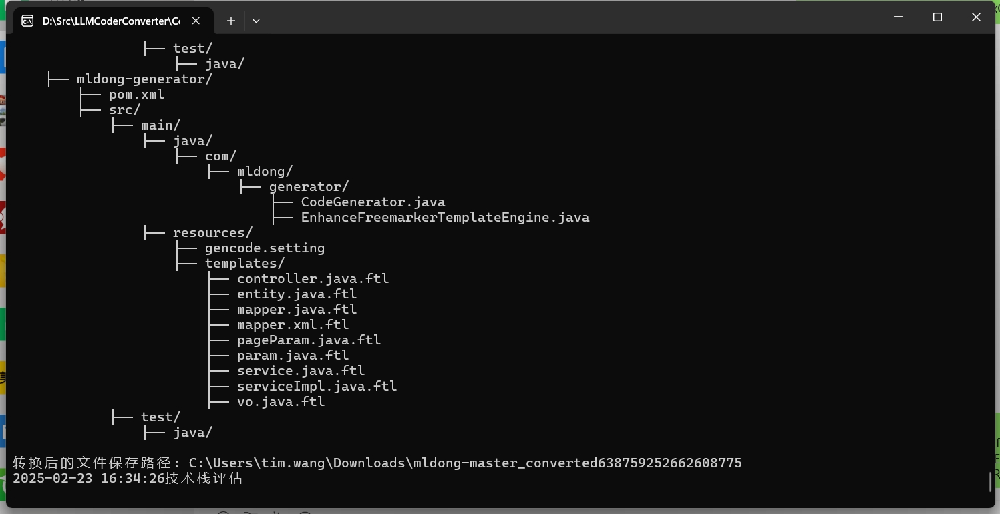

LLM-based code repository converter

[Engilish](./readme_en.md) || 
[中文版readme](./readme.md)
# LLM智能代码库转换器

## 项目简介
探索大模型在整个代码库迁移中的应用。

LLM智能代码库转换器是一个基于大语言模型的代码转换工具，能够根据用户需求和现有代码库智能转换为目标编程语言和框架的实现。

本项目利用 DeepSeek 大语言模型的强大能力，实现了智能的代码库分析、转换和生成功能。


## 警告
 - 本工具转换的结果不稳定，仍有大量编译类错误、文件缺失等问题，请谨慎使用
 - 本工具仍处于demo阶段，仅测试了部分语言及场景，请谨慎使用
 - 由于是基于大语言模型转换，无法保证转换后的代码完全符合预期，请谨慎使用
 - 本工具可能有大模型的幻觉问题，请谨慎使用
 - 本工具会产生大量的大模型API调用，请关注账户余额&谨慎使用
 - 本工具仅支持转换代码，不支持转换资源文件、图片、视频等非代码文件
 - 转换后的代码请务必进行人工审查和测试


## 主要功能

 **代码智能转换**
   - 支持多种编程语言间的代码转换
   - 自动处理语言特性差异
   - 保持代码结构和业务逻辑
   - 智能适配目标框架特性
 
 **适用场景**
   - 代码重构：从一种语言转换到另一种语言
   - 技术栈迁移：从一种技术栈迁移到另一种技术栈
   - SDK开发包转换：将SDK开发包转换为其他语言的SDK开发包，如只有java的开发包时，可反编译jar后转换为其他语言的SDK开发包
   - 节省代码迁移工作量：避免翻译字段、API调用等
 
## 技术架构
- 开发语言：C# (.NET 9)
- 核心依赖：
  - OpenAI SDK：用于与大语言模型API交互
  - Markdig：Markdown解析和处理
  - System.Text.Json：JSON数据处理
  
## 项目结构
```
├── Program.cs              # 程序入口
├── CodeConverter.cs        # 代码转换核心实现
├── ModuleAnalyser.cs      # 模块分析器
├── Models/                 # 数据模型
├── templates/             # 提示词模板
└── LLMSmartConverter.csproj # 项目配置文件
```

## 使用方法

确保原始代码库的zip文件内包含readme.md文件，并提供了原始代码库的说明，如果没有请手动创建后再压缩后进行转换。

推荐使用火山引擎的API Key，因为深度求索的API 暂时稳定性较差，腾讯云的API Key稳定性较好但是速度稍慢。

欢迎使用我的火山引擎邀请码：TCWF24UW

[火山引擎体验链接](https://www.volcengine.com/experience/ark?utm_term=202502dsinvite&ac=DSASUQY5&rc=TCWF24UW)


**运行程序**
- 输入需要转换的代码库zip文件路径 
- 输入需要转换到的目标开发语言 
- 输入需要转换到的目标技术栈、框架及库（如ASP.NET Core+EF Core+Redis） 
- 输入其他的转换要求及说明（如代码规范、安全标准、类型映射规则、目标库、目标模式等） 
- 输入LLM供应商类型（1对应火山引擎、2对应深度求索官方、3对应腾讯云） 
- 输入LLM API Key
- 等待转换结果，在原路径生成转换后的代码库文件夹  
 




## 注意事项
- 确保有足够的API调用额度
- 建议在转换大型项目时分批处理
- 转换后的代码需要进行人工审查和测试

## 开发计划
- [ ] 支持更多模型供应商及模型
- [ ] 支持更多编程语言和框架
- [ ] 优化代码转换准确性
- [ ] 添加批量处理功能
- [ ] 提供Web界面
- [ ] 增加单元测试覆盖

## 贡献指南
欢迎提交Issue和Pull Request来帮助改进项目。

## 许可证
本项目采用 MIT 许可证。
