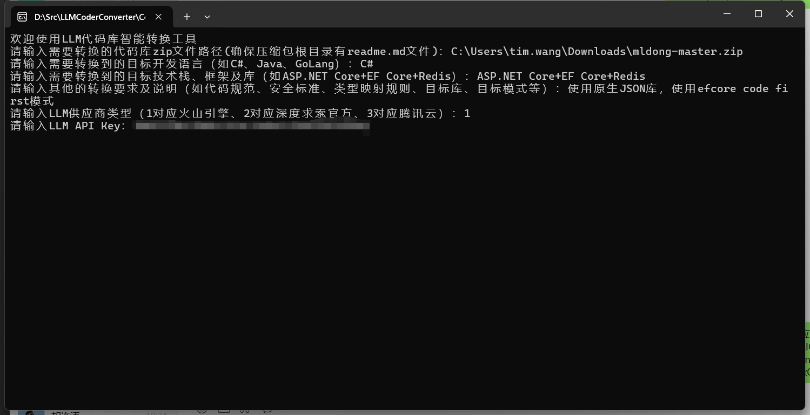
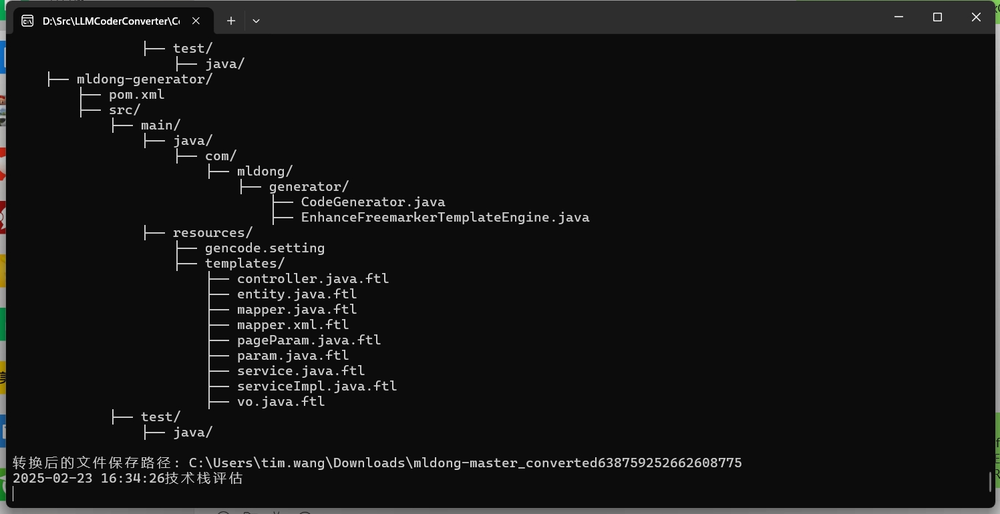
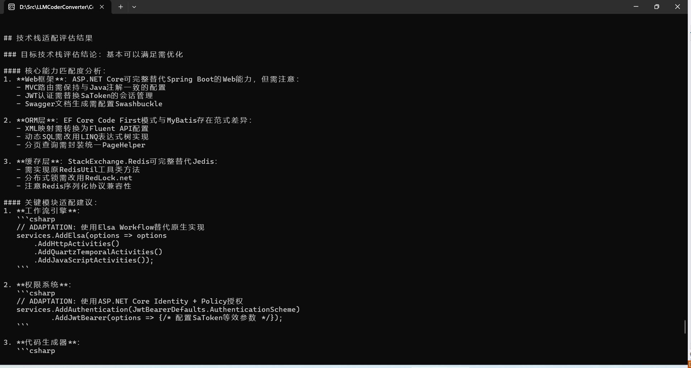

LLM-based code repository converter

[中文版readme](./readme.md)

# LLM Intelligent Code Repository Converter

## Project Introduction
Exploring the application of large language models in the entire code repository migration.

The LLM Intelligent Code Repository Converter is a code conversion tool based on large language models. It can intelligently convert user requirements and existing code into the implementation of the target programming language and framework.

This project utilizes the powerful capabilities of the DeepSeek large language model to achieve intelligent code repository analysis, conversion, and generation functions.

## Warnings
 - The conversion results of this tool are unstable, and there are still many problems such as compilation errors and missing files. Please use it with caution.
 - This tool is still in the demo stage and has only been tested in some languages and scenarios. Please use it with caution.
 - Since it is based on large language model conversion, there is no guarantee that the converted code will fully meet expectations. Please use it with caution.
 - This tool may have the problem of large model hallucinations. Please use it with caution.
 - This tool will generate a large number of large model API calls, please pay attention to your account balance & use it with caution.
 - This tool only supports the conversion of code and does not support the conversion of non-code files such as resource files, pictures, and videos.
 - The converted code must be manually reviewed and tested.

## Main Features

**Intelligent Code Conversion**
   - Supports code conversion between multiple programming languages.
   - Automatically handles language feature differences.
   - Maintains code structure and business logic.
   - Intelligently adapts to the characteristics of the target framework.
 
**Use Cases**
   - Code refactoring: Converting from one language to another.
   - Technology stack migration: Migrating from one technology stack to another.
   - SDK package conversion: Convert SDK packages to SDK packages in other languages. For example, if there is only a Java package, you can decompile the jar and convert it to SDK packages in other languages.
   - Reduce code migration workload: Avoid translating fields, API calls, etc.
 
## Technical Architecture
- Development Language: C# (.NET 9)
- Core Dependencies:
  - OpenAI SDK: Used to interact with the large language model API.
  - Markdig: Markdown parsing and processing.
  - System.Text.Json: JSON data processing.
  
## Project Structure

## Instructions for Use

Make sure that the zip file of the original code repository contains the readme.md file and provides a description of the original code repository. If not, please create it manually, then compress it and convert it.

It is recommended to use the API Key of Volcano Engine, because the API of DeepSeek is temporarily less stable. The API Key of Tencent Cloud is more stable but slower.

Welcome to use my Volcano Engine invitation code: TCWF24UW

[Volcano Engine Experience Link](https://www.volcengine.com/experience/ark?utm_term=202502dsinvite&ac=DSASUQY5&rc=TCWF24UW)

**Run Program**
- Enter the path of the zip file of the code repository that needs to be converted.
- Enter the target development language to be converted to.
- Enter the target technology stack, framework and library to be converted to (such as ASP.NET Core+EF Core+Redis).
- Enter other conversion requirements and instructions (such as code specifications, security standards, type mapping rules, target libraries, target patterns, etc.).
- Enter the LLM provider type (1 corresponds to Volcano Engine, 2 corresponds to DeepSeek official, 3 corresponds to Tencent Cloud).
- Enter the LLM API Key.
- Wait for the conversion result, and the converted code repository folder will be generated in the original path.
 

## Precautions
- Make sure you have enough API call quota.
- It is recommended to process in batches when converting large projects.
- The converted code needs to be manually reviewed and tested.

## Development Plan
- [ ] Support more model providers and models.
- [ ] Support more programming languages and frameworks.
- [ ] Optimize the accuracy of code conversion.
- [ ] Add batch processing function.
- [ ] Provide Web interface.
- [ ] Increase unit test coverage.

## Contribution Guide
Welcome to submit Issues and Pull Requests to help improve the project.

## License
This project uses the MIT license.
